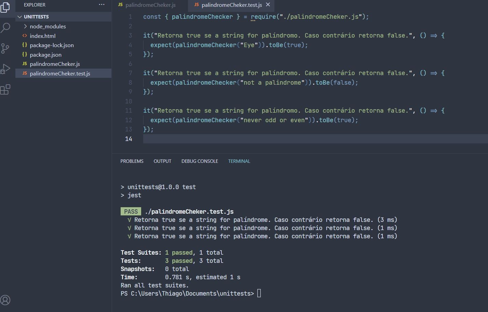

# Testes unitários básicos usando Jest

### Este repositório serve para guardar alguns testes unitários. Estou aprendendo como realizar alguns teste de forma básica usando Jest.

Infos:

- Baixe ou clone o reposítório.
- Instale as dependências.
- Execute ou refatore os testes

## Tecnologias

 

---

<h2 align="center">Testes usando Jest</h2>

---

 
___
